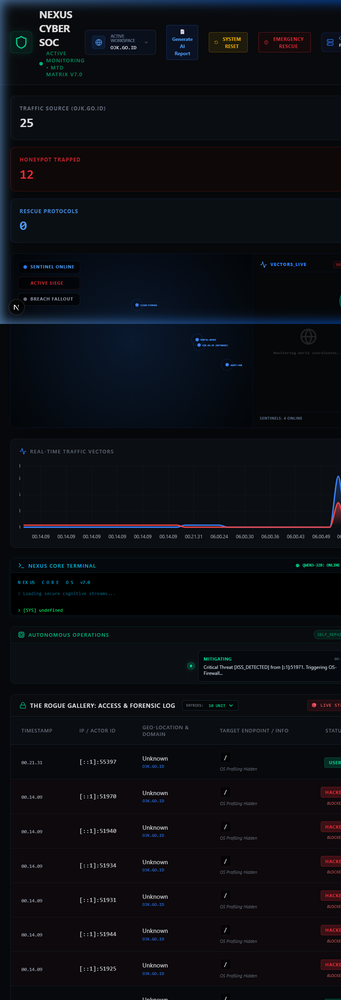
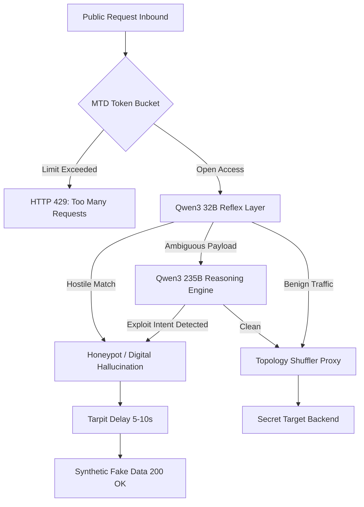
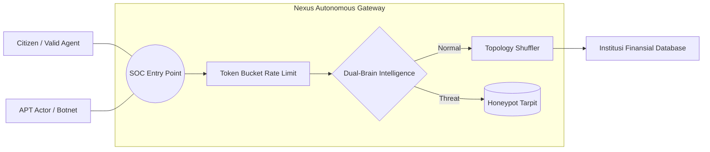

# 🛡️ Nexus Cyber SOC v13.2
**Autonomous Tactical Defense Grid & Geospatial Threat Intelligence Command Center**

---

## 1. 🛑 Masalah Infrastruktur Modern (The Problem)
Di era kedaulatan digital, institusi publik dan pusat data finansial (OJK, BI, Kemenkeu) menghadapi ancaman yang tidak bisa lagi ditangani oleh sistem keamanan tradisional:
- **Static Infrastructure Vulnerability**: Server konvensional memiliki titik masuk (IP/Port) yang statis, memudahkan aktor ancaman melakukan **Reconnaissance** dan pemetaan serangan yang presisi.
- **Rule-Based WAF Obsolescence**: Web Application Firewall tradisional hanya mengandalkan *Regex Signature* yang kaku, sehingga mudah ditembus oleh **0-Day Exploits**, **Obfuscated Payloads**, dan teknik polimorfik.
- **Asymmetric Warfare Damage**: Kebocoran data masif dapat terjadi dalam hitungan milidetik sebelum operator manusia menyadari adanya penetrasi.

---

## 2. 💡 Kenapa Nexus Cyber Lebih Unggul? (Technical UVP)
Nexus Cyber beroperasi sebagai **Autonomous Guardian** yang menggabungkan eskapisme (MTD) dan agresi intelijen (Dual-Brain AI) melalui sistematisasi berikut:

- **Predictive Intent Deduction (Dual-Brain AI Inference):**
  - **Layer 1: Reflex System (Sub-100ms Inference)**: Menggunakan model *Quantized LLM* (Llama/Qwen-Fast) untuk melakukan pemindaian *linear-time* terhadap payload Inbound. Berfokus pada deteksi pola anomali tingkat tinggi sebelum paket menyentuh aplikasi.
  - **Layer 2: Reasoning Engine (Heuristic Deductive Logic)**: Jika ditemukan muatan yang terobfuskasi atau *0-Day candidate*, paket dialihkan ke mesin pemikiran mendalam (Reasoning). Ia mendeduksi *niat logis* (Logical Intent) di balik sintaks berbahaya, bukan sekadar mencocokkan regex statis. Ini memastikan perlindungan terhadap serangan polimorfik yang mampu mengecoh WAF Enterprise sekalipun.
  - **Immunity Feedback Loop**: Setiap deteksi berhasil akan memicu pembuatan tanda tangan digital unik (*Antibody-Lite*) yang disimpan secara asinkron di Redis Distributed Cache sebagai layer proteksi instan (O(1)) bagi node gateway lainnya.

- **Infinite Escape (Moving Target Defense - MTD):**
  - **CSPRNG-Driven Topology Rotation**: Menggunakan generator angka acak kriptografis (CSPRNG) untuk merotasi titik temu backend secara berkala. Ini menghancurkan akurasi pemetaan jaringan (*Network Reconnaissance*) oleh penyerang.
  - **Atomic Proxy Handoff**: Gateway melakukan swapping *reverse-proxy pointer* secara atomik di tingkat memori. Memungkinkan rotasi backend target (IP, Port, Route) tanpa menyebabkan *Packet Drop* atau diskoneksi pada sesi pengguna yang sah (*Active Session Persistence*).
  - **Entropy-Based Obfuscation**: Dengan mengubah arsitektur internal di bawah karpet secara dinamis, Nexus membuat peta infrastruktur yang ditemukan hacker melalui Nmap atau scanning tool lainnya menjadi kedaluwarsa dalam hitungan detik.

- **Reverse Attribution & Digital Hallucination (Tarpitting):**
  - **Containerized Honeypot Tarpit**: Bukannya memblokir, trafik berbahaya dialihkan secara transparan ke lingkungan isolasi tinggi (Sandboxed Environment). Peretas akan mendapatkan respons `HTTP 200 OK` semu dengan data sintetis (*Synthetic Intelligence Data*).
  - **Computational Resource Exhaustion**: Melalui teknik Tarpitting, Nexus menyuntikkan *latency injection* (5,000ms - 10,000ms) pada setiap respons berbahaya. Ini memaksa server penyerang (Botnet) menggunakan memori dan bandwidth secara redundan tanpa memberikan hasil nyata, secara efektif melakukan serangan balik terhadap biaya operasional penyerang.
  - **Behavioral Profiling**: Selama peretas terjebak dalam "Halusinasi Digital", sistem merekam seluruh taktik, teknik, dan prosedur (TTP) mereka untuk penyusunan laporan intelijen taktis otomatis.

---

## ️ 3. Geospatial Tactical Command Center (Dashboard Overview)
Antarmuka SOC v13 dirancang untuk **Situational Awareness** tingkat tinggi:
- **🔵 Tactical Radar Hub:** Memetakan **Sentinel Nodes** (Aset Kritis) dan **Red Vector Arcs** (Serangan Aktif) secara geospatial. Menyediakan visualisasi jarak (*Proximity*) penyerang terhadap target.
- **📈 Real-Time Traffic Splicer:** Streaming telemetri volume trafik normal vs ancaman secara sub-detik.
- **🧠 Autonomous Operations Log:** Catatan kognitif deduksi AI Reflex & Reasoning secara transparan.
- **🗺️ Vectors_Live Sidebar:** Manifest data penyerang (IP, Geo-Coord, Payload Type) yang masuk ke gateway.

---

## ⚙️ 4. Arsitektur Pertahanan & Flowchart

### A. Flowchart Operasi (Sistematik)

### B. Use Case Penggunaan (SOC Context)

---

## 🏗️ 5. Solusi Tingkat Tinggi & Imunitas Otonom

### A. Virtual Patching (Antibody System)
Sistem **Layer 0** yang menciptakan "Kekebalan Lokal":
- AI menciptakan **Signature Antibody** seketika setelah serangan pertama terdeteksi.
- Antibody disebar ke seluruh node (Redis Sync) untuk pemblokiran instan (**O(1) Accuracy**) pada serangan berikutnya tanpa beban AI.

### B. Executive Intelligence Reporting (AIS)
Mesin pelaporan **Asynchronous Intelligence Synthesis** (AIS):
- Menarik metrik agregasi dari Redis (Allowed, Blocked, Immune).
- AI menyusun narasi rekapitulasi keamanan dan rekomendasi strategis dalam format laporan PDF resmi kementerian.

### C. Cognitive Purge (Global Atomic Reset)
Sinkronisasi pembersihan total jejak serangan:
- **Atomic Reset:** Menghapus counter statistik, metrik domain, dan antibody buffers secara serentak di seluruh cluster gateway dan distributed cache.

---

## 🕹️ Command Center CLI Guide

| Perintah | Deskripsi Teknis |
| :--- | :--- |
| `/help` | Manifest perintah biner bantuan. |
| `/status` | Audit kesehatan telemetri & Redis Probe. |
| `/ban [IP]` | Injeksi antibody manual ke Distributed Set. |
| `@nexus [MSG]`| Query kognitif ke AI Reasoning Engine. |

---
*Nexus Cyber SOC v13.2: Menjaga Kedaulatan Digital Indonesia dengan Imunitas Otonom & Intelijen Taktis.*
