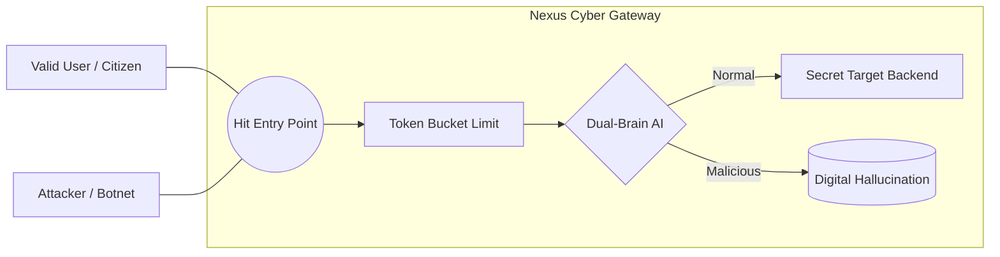
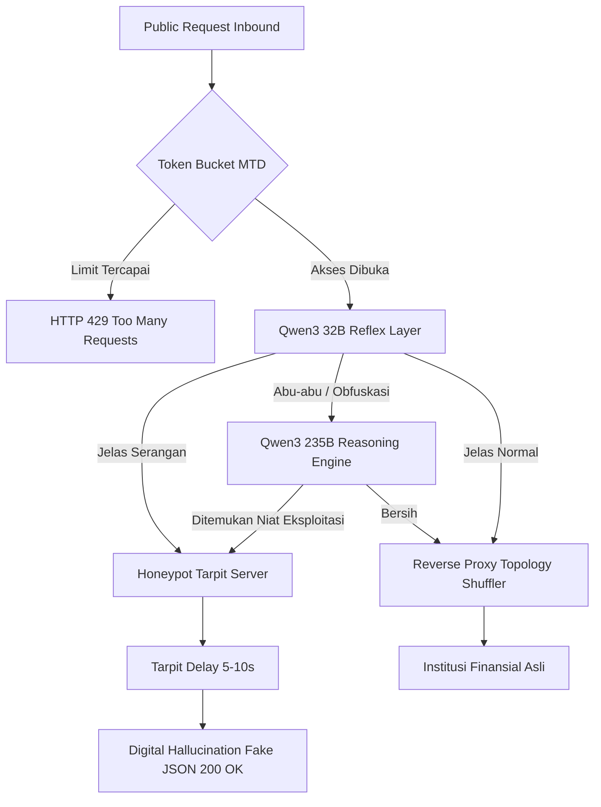

# 🛡️ Nexus Cyber
**Autonomous Dual-Brain Infrastructure Protection & Moving Target Defense (MTD)**

---

## 1. 🛑 Masalah yang Ingin Diselesaikan (The Problem)
Di era digital saat ini, institusi publik dan pusat data finansial (seperti BSSN, BI, OJK) menjadi sasaran empuk serangan siber tingkat lanjut (Advanced Persistent Threats/APT) dan serangan _Botnet_ / DDoS skala besar. Masalah utama yang ada saat ini:
- **Infrastruktur Statis**: Server tradisional bersifat kaku (IP dan titik masuk selalu sama), menjadikannya target yang mudah bagi *hacker* untuk dipetakan secara diam-diam (reconnaissance) lalu dieksploitasi kapan saja.
- **Rule-Based WAF yang Mudah Ditembus**: Web Application Firewall konvensional hanya mengandalkan daftar aturan blokir yang kaku (_regex signatures_). Peretas modern dengan mudah membypass batasan ini menggunakan skema _obfuscation_, _0-day exploits_, atau *payload* yang belum terdaftar di database dunia.
- **Data Leak / Kebocoran Masif**: Begitu *hacker* menemukan endpoint rentan, penyedotan jutaan data rekam nasabah dan privasi dapat lenyap dalam hitungan per-sekian detik.

---

## 2. 💡 Solusi yang Dihadirkan (The Solution)
**Nexus Cyber** hadir sebagai gerbang pertahanan otonom berarsitektur _Zero-Trust_ yang mengkombinasikan agresi dan eskapisme untuk menggagalkan skema penyerang paling cerdas sekalipun:
1. **Dual-Brain AI Intelligence**: Tidak mendeteksi *syntax* kaku, tapi membaca *niat ancaman* (Logical Intent). Mengkombinasikan dua arsitektur Large Language Model tercepat: **Qwen3 32B Reflex** untuk blokir kilat, serta **Qwen3 235B Reasoning** untuk mendeduksi anomali obfuskasi kompleks layaknya pakar Cybersecurity manusia.
2. **Moving Target Defense (MTD)**: Modul pertahanan dinamis yang merotasi posisi lapisan backend (*Topology Shuffler*) secara tersembunyi dengan generator kriptografi acak terbatas (CSPRNG), menghancurkan peta infrastruktur seketika dari kacamata hacker.
3. **Digital Hallucination (Honeypot Tarpit)**: Bukannya memblokir akses penyerang dengan `HTTP 403 Forbidden` (yang mana menunjukkan padanya bahwa pertahanan ada dan memaksa mereka mencari taktik lain), Nexus akan mengarahkan serangan ganas ke sebuah dimensi palsu (Honeypot). Mereka ditahan disana (efek Tarpit) dan akhirnya diberikan respons semu "Fake Data 200 OK". Membuat penyerang puas mencuri *data sampah halusinasi*.

---

## 3. 🚀 Kenapa Solusi Ini Lebih Ideal?
- **AI-Native Tanpa Update Rule Berkala**: Bekerja terstruktur bebas dari rutinitas update _Signature_. Modul reasoning mampu menangkap tipe serangan masa depan (Zero-Day) seakan-akan ia ahli bahasa sintaks.
- **Pelemahan Atribut Penyerang (Reverse-Engage)**: Tidak hanya melindungi server asli, namun juga *membuang-buang Bandwidth, Waktu komputasi, serta Biaya Finansial Server penyerang (Botnet)* karena waktu *timeout* yang panjang disuntikkan oleh sistem Tarpit kita tanpa membebani memori lokal.
- **Smooth Dashboard Compliance**: Tersedia *Telemetry Dashboard Command Center* berpusat metrik ISO 25010 dengan indikator waktu nyata tanpa *memory-leak* yang siap memonitor perang sibernya secara 60fps untuk kepentingan eksekutif tingkat atas.

---

## 4. ⚙️ Arsitektur Sistem 
Nexus Cyber diabstraksikan menjadi **3 Lapisan Utama** (The Nexus Shield):
1. **Network Parameter Layer (MTD)**  
   - *Per-IP Token Bucket:* Membendung serangan spam flooding.
   - *Topology Shuffler:* Mengalihkan alur titik temu reverse proxy di bawah karpet secara CSPRNG.
2. **Cognitive Detection Layer (AI Dual-Brain)**
   - *Reflex System (Groq GPU / Llama Fast)*: Layer 1 mitigasi sub-100ms.
   - *Reasoning Engine (OpenRouter XL)*: Layer 2 deep-thinking logic.
3. **Trap & Reverse Execution Layer**
   - Transisi *Benign Traffic* ke institusi/backend secara transparan (User Aman).
   - Pengalihan _Malicious Traffic_ ke dalam _Server Tarpit Asing_ isolasi tinggi.

---

## 5. 👥 Use Case Diagram

---

## 6. 🔄 Flowchart Penggunaan Program

---

## 7. 💎 Yang Membedakan Dengan Produk Lainnya (UVP)

| Fitur / Metrik | WAF Tradisional (Konvensional) | Solusi Enterprise / Cloud Security Umum | **NEXUS CYBER OTONOMUS** |
| :--- | :--- | :--- | :--- |
| **Response Terhadap Serangan** | Drop Koneksi seketika (HTTP 403 Forbidden) | Blocking Endpoint / Captcha | **Digital Hallucination & Tarpit Trap**. Berikan ilusi ke Hacker bahwa ia menang lalu merekam aksinya |
| **Cara Filterisasi Payload** | Regex / IP Blacklisting Statis | Machine Learning Sederhana | **LLM Dual-Brain (Reasoning AI)**. Ia paham _"Kenapa"_ teks itu ditulis (_Logical deduction_) |
| **Peta Jaringan Backend** | Publik IP & Port tertembak tetap *Fixed* | IP internal Load Balancer konstan | **Topology Shuffler (MTD)**. Pindah target *routing* secara asinkron tanpa disadari siapa pun |
| **Beban Latensi Pengguna Sah** | Sering kena *False Positive* pada sintaks unik | Pemrosesan paket yang membebani | AI membedah filter dalam hitungan milidetik secara asinkron dengan _go-routines_. |

---
*Dibangun dengan dedikasi tinggi & keamanan standar militer.*
