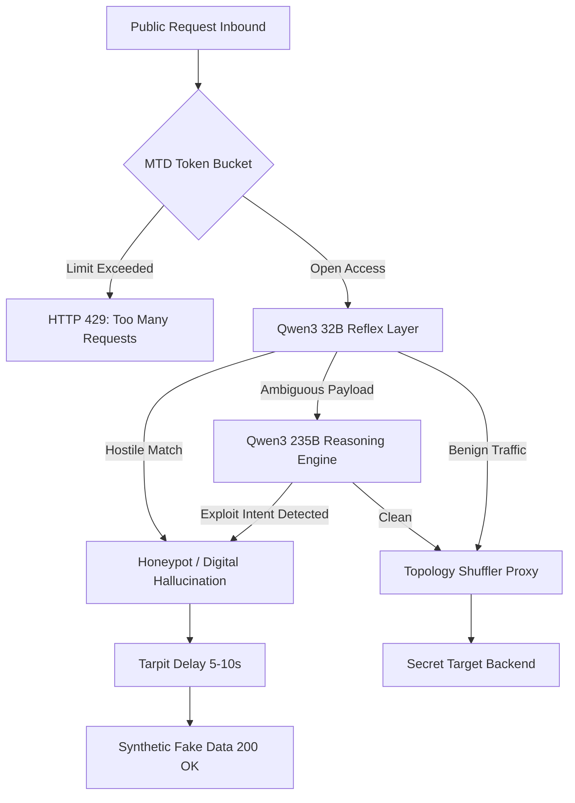
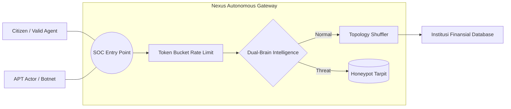

# 🛡️ Nexus Cyber SOC v13.2
**Autonomous Tactical Defense Grid & Geospatial Threat Intelligence Command Center**

---

## 1. 🛑 Masalah Infrastruktur Modern (The Problem)
Di era kedaulatan digital, institusi publik dan pusat data finansial (OJK, BI, Kemenkeu) menghadapi ancaman yang tidak bisa lagi ditangani oleh sistem keamanan tradisional:
- **Static Infrastructure Vulnerability**: Server konvensional memiliki titik masuk (IP/Port) yang statis, memudahkan aktor ancaman melakukan **Reconnaissance** dan pemetaan serangan yang presisi.
- **Rule-Based WAF Obsolescence**: Web Application Firewall tradisional hanya mengandalkan *Regex Signature* yang kaku, sehingga mudah ditembus oleh **0-Day Exploits**, **Obfuscated Payloads**, dan teknik polimorfik.
- **Asymmetric Warfare Damage**: Kebocoran data masif dapat terjadi dalam hitungan milidetik sebelum operator manusia menyadari adanya penetrasi.

---

## 2. 💡 Kenapa Nexus Cyber Lebih Unggul? (The Solution & UVP)
Nexus Cyber beroperasi sebagai **Autonomous Guardian** yang menggabungkan eskapisme (MTD) dan agresi intelijen (Dual-Brain AI):
- **Predictive Intent Deduction**: Alih-alih mencari *keyword* blokir, Nexus membaca *niat logis* serangan menggunakan **Qwen3 Dual-Brain AI**, memungkinkan deteksi ancaman yang belum pernah ditemukan sebelumnya (Zero-Day).
- **Infinite Escape (MTD)**: Melumpuhkan strategi pemetaan Hacker dengan terus-menerus merotasi topologi backend secara kriptografis tanpa interupsi layanan.
- **Reverse Attribution & Tarpitting**: Tidak hanya memblokir, Nexus "menjebak" penyerang dalam **Digital Hallucination** (Honeypot) untuk merekam perilaku mereka sembari menguras sumber daya komputasi penyerang.

---

## �️ 3. Geospatial Tactical Command Center (Dashboard Overview)
Antarmuka SOC v13 dirancang untuk **Situational Awareness** tingkat tinggi:
- **🔵 Tactical Radar Hub:** Memetakan **Sentinel Nodes** (Aset Kritis) dan **Red Vector Arcs** (Serangan Aktif) secara geospatial. Menyediakan visualisasi jarak (*Proximity*) penyerang terhadap target.
- **📈 Real-Time Traffic Splicer:** Streaming telemetri volume trafik normal vs ancaman secara sub-detik.
- **🧠 Autonomous Operations Log:** Catatan kognitif deduksi AI Reflex & Reasoning secara transparan.
- **🗺️ Vectors_Live Sidebar:** Manifest data penyerang (IP, Geo-Coord, Payload Type) yang masuk ke gateway.

---

## ⚙️ 4. Arsitektur Pertahanan & Flowchart

### A. Flowchart Operasi (Sistematik)

### B. Use Case Penggunaan (SOC Context)

---

## 🏗️ 5. Solusi Tingkat Tinggi & Imunitas Otonom

### A. Virtual Patching (Antibody System)
Sistem **Layer 0** yang menciptakan "Kekebalan Lokal":
- AI menciptakan **Signature Antibody** seketika setelah serangan pertama terdeteksi.
- Antibody disebar ke seluruh node (Redis Sync) untuk pemblokiran instan (**O(1) Accuracy**) pada serangan berikutnya tanpa beban AI.

### B. Executive Intelligence Reporting (AIS)
Mesin pelaporan **Asynchronous Intelligence Synthesis** (AIS):
- Menarik metrik agregasi dari Redis (Allowed, Blocked, Immune).
- AI menyusun narasi rekapitulasi keamanan dan rekomendasi strategis dalam format laporan PDF resmi kementerian.

### C. Cognitive Purge (Global Atomic Reset)
Sinkronisasi pembersihan total jejak serangan:
- **Atomic Reset:** Menghapus counter statistik, metrik domain, dan antibody buffers secara serentak di seluruh cluster gateway dan distributed cache.

---

## 🕹️ Command Center CLI Guide

| Perintah | Deskripsi Teknis |
| :--- | :--- |
| `/help` | Manifest perintah biner bantuan. |
| `/status` | Audit kesehatan telemetri & Redis Probe. |
| `/ban [IP]` | Injeksi antibody manual ke Distributed Set. |
| `@nexus [MSG]`| Query kognitif ke AI Reasoning Engine. |

---
*Nexus Cyber SOC v13.2: Menjaga Kedaulatan Digital Indonesia dengan Imunitas Otonom & Intelijen Taktis.*
