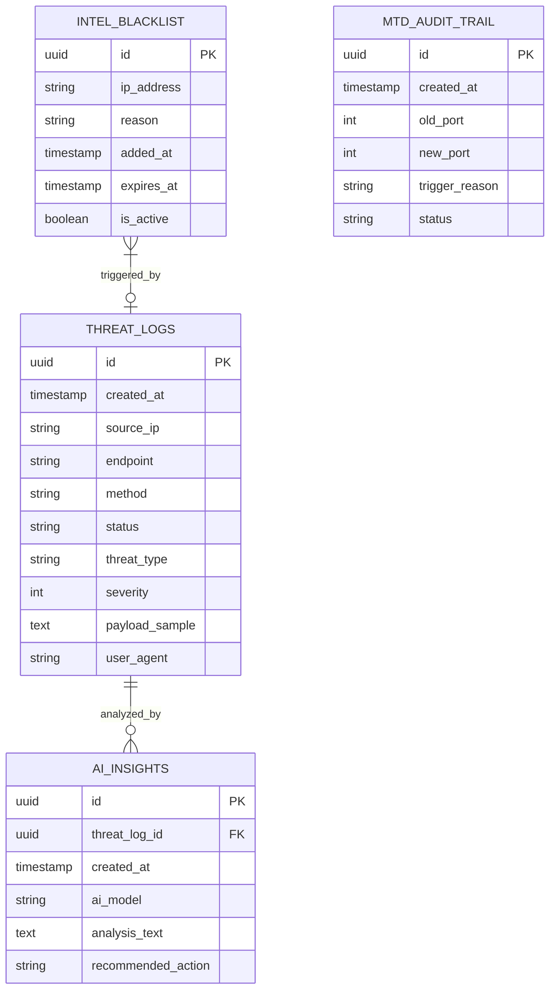

# 🗄️ Nexus Cyber Database Schema

Dokumen ini mendeskripsikan skema basis data relasional (PostgreSQL) yang digunakan oleh **Nexus Cyber Security System** untuk kebutuhan persistensi data jangka panjang, audit forensik, dan intelijen ancaman (*Threat Intelligence*). Skema ini dirancang agar mematuhi standar keamanan internasional ISO 27001.

---

## 🛡️ Kepatuhan Standar ISO 27001 (ISMS)

**ISO/IEC 27001** adalah standar internasional tingkat tertinggi untuk **Sistem Manajemen Keamanan Informasi (ISMS)**. Standar ini mewajibkan organisasi untuk memiliki kendali ketat terhadap data, jejak audit, dan pelaporan insiden.

Skema database Nexus Cyber dirancang **secara spesifik** untuk memenuhi klausul wajib dalam ISO 27001:
1. **Klausul A.12.4.1 (Event Logging)**: Mewajibkan sistem merekam kejadian keamanan secara rinci. Tabel `threat_logs` memastikan setiap upaya serangan (IP, Waktu, Payload) tercatat rapi sebagai alat bukti investigasi forensik.
2. **Klausul A.12.4.2 (Protection of Log Information)**: Log fasilitas harus dilindungi dari perusakan. Menyimpan log di dalam database terpisah (PostgreSQL) mencegah penyerang ("hacker") menghapus jejak mereka, yang sering terjadi jika log hanya disimpan di file teks lokal.
3. **Klausul A.12.4.3 (Administrator & Operator Logs)**: Mewajibkan adanya *audit trail* (jejak rekam) atas perubahan sistem. Tabel `mtd_audit_trail` membuktikan kepada auditor keamanan bahwa fitur otonom (pemutaran port MTD) aktif dan tercatat secara resmi.
4. **Klausul A.16.1 (Incident Management)**: Mewajibkan organisasi memiliki prosedur respons insiden. Tabel `intel_blacklist` dan `ai_insights` memungkinkan administrator untuk mengambil keputusan cepat berdasarkan data ancaman historis.

---

## 🗺️ Entity-Relationship Diagram (ERD)

---

## 📊 Detail Tabel

### 1. `threat_logs` (Forensik Serangan)
Tabel utama untuk merekam seluruh anomali dan serangan yang ditangkap oleh Nexus Gateway.
*   **Tujuan**: Audit keamanan, analisis pola serangan historis, dan pelaporan (*Reporting*).

| Kolom | Tipe Data | Keterangan |
| :--- | :--- | :--- |
| `id` | `UUID` | Primary Key. |
| `created_at` | `TIMESTAMP` | Waktu pasti serangan terjadi. |
| `source_ip` | `VARCHAR(45)` | IP Address penyerang (Mendukung IPv4 & IPv6). |
| `endpoint` | `VARCHAR(255)` | URL/Endpoint target yang diserang. |
| `method` | `VARCHAR(10)` | HTTP Method (GET, POST, dll). |
| `status` | `VARCHAR(50)` | Status penanganan (BLOCKED, ALLOWED, HONEYPOT). |
| `threat_type` | `VARCHAR(100)` | Kategori serangan (SQL Injection, XSS, Brute Force). |
| `severity` | `INTEGER` | Tingkat bahaya (1 = Rendah, 5 = Kritis). |
| `payload_sample` | `TEXT` | Potongan data berbahaya yang dikirim penyerang. |
| `user_agent` | `TEXT` | Informasi browser/bot penyerang. |

---

### 2. `mtd_audit_trail` (Jejak MTD)
Tabel untuk mencatat aktivitas *Moving Target Defense* (MTD) seperti perputaran port (*Port Shuffling*).
*   **Tujuan**: Membuktikan kepada auditor ISO 27001 bahwa pertahanan dinamis selalu aktif.

| Kolom | Tipe Data | Keterangan |
| :--- | :--- | :--- |
| `id` | `UUID` | Primary Key. |
| `created_at` | `TIMESTAMP` | Waktu *shuffling* terjadi. |
| `old_port` | `INTEGER` | Port target sebelumnya. |
| `new_port` | `INTEGER` | Port target yang baru. |
| `trigger_reason` | `VARCHAR(100)`| Alasan pindah (Scheduled, Anomaly Detected, Manual).|
| `status` | `VARCHAR(50)` | Status eksekusi (SUCCESS, FAILED). |

---

### 3. `intel_blacklist` (Daftar Cekal Dinamis)
Tabel untuk menyimpan daftar IP yang telah diblokir secara permanen atau sementara. Gateway akan mengecek tabel (atau cache Redis dari tabel ini) sebelum memproses request.
*   **Tujuan**: Mitigasi proaktif terhadap ancaman yang sudah diketahui (Zero-Trust).

| Kolom | Tipe Data | Keterangan |
| :--- | :--- | :--- |
| `id` | `UUID` | Primary Key. |
| `ip_address` | `VARCHAR(45)` | IP Address yang diblokir. |
| `reason` | `VARCHAR(255)` | Alasan pemblokiran (misal: "Repeated SQLi attempts"). |
| `added_at` | `TIMESTAMP` | Waktu IP dimasukkan ke daftar hitam. |
| `expires_at` | `TIMESTAMP` | Waktu blokir dicabut (NULL = Blokir permanen). |
| `is_active` | `BOOLEAN` | Status aturan blokir (TRUE = Aktif). |

---

### 4. `ai_insights` (Laporan Intelijen AI)
Menyimpan hasil pemikiran dan rekomendasi dari **NEXUS-SOC-BRAIN** (Ollama/Groq) terkait suatu serangan spesifik.
*   **Tujuan**: Menyimpan pengetahuan (*Knowledge*) AI agar admin bisa meninjau ulang keputusan AI di masa lalu.

| Kolom | Tipe Data | Keterangan |
| :--- | :--- | :--- |
| `id` | `UUID` | Primary Key. |
| `threat_log_id`| `UUID` | Foreign Key ke `threat_logs`. |
| `created_at` | `TIMESTAMP` | Waktu analisis dilakukan. |
| `ai_model` | `VARCHAR(100)`| Model yang memproses (misal: qwen2.5-coder:7b). |
| `analysis_text`| `TEXT` | Kesimpulan deskriptif dari AI. |
| `recommended_action`| `VARCHAR(255)`| Saran tindakan (misal: "Isolate IP", "Ignore"). |
