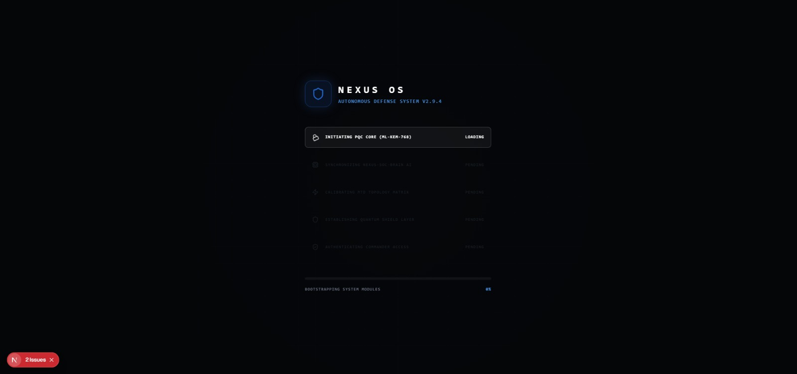
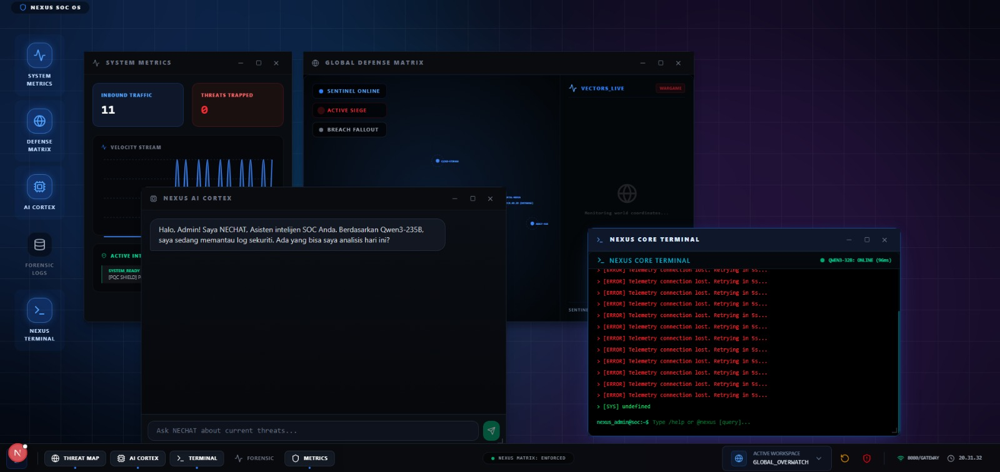
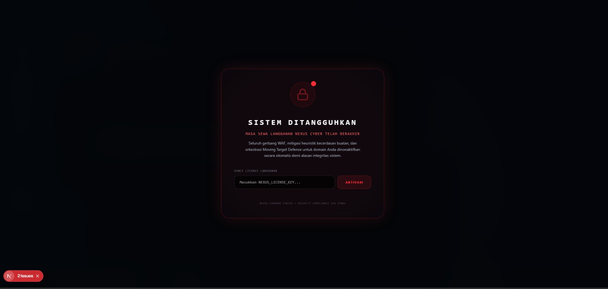

# 🖥️ Nexus Cyber - Command Center Admin Dashboard (Tahap 2)

Dasbor Security Operations Center (SOC) berbasis web premium yang dibangun menggunakan **Next.js 15 (Turbopack)**, **TailwindCSS**, **Framer Motion**, dan **Lucide Icons**. Dasbor ini berfungsi sebagai pusat visualisasi telemetri pertahanan, mitigasi ancaman waktu-nyata (real-time), dan kepatuhan Moving Target Defense (MTD).

---

## 📸 Antarmuka Dashboard (Screenshots)

Berikut adalah visualisasi sistem nyata hasil audit uji stres pertahanan siber pada fase 2:

### 1. Pemuatan Modul Sistem (Boot Sequence)
Menampilkan inisialisasi modul persandian pasca-kuantum (PQC ML-KEM-768), sinkronisasi AI lokal, dan kalibrasi matriks topologi MTD secara dinamis dan aman.



### 2. Panel Kendali Utama (SOC Command Center Dashboard)
Pusat kendali taktis terpadu dengan orkestrasi windows dinamis. Menampilkan grafik laju paket, visualisasi peta serangan siber global (*Geospatial Threat Map*), telemetri logs forensik, terminal kendali administrator, dan panel **MTD Security Audit** untuk pengujian stres langsung.



### 3. Modul Kunci Lisensi Keamanan (Licensing Lockout Overlay)
Layar pengunci gelap premium yang menangguhkan sistem WAF dan memblokir akses dasbor secara absolut jika lisensi langganan klien terdeteksi tidak valid, kedaluwarsa, atau dicabut.



---

## 🛠️ Panduan Memulai (Getting Started)

### 1. Prasyarat
Pastikan Anda telah menginstal Node.js versi LTS terbaru pada sistem lokal Anda.

### 2. Pemasangan Dependensi
Pasang semua paket pustaka yang dibutuhkan menggunakan NPM:
```bash
npm install
```

### 3. Menjalankan Server Pengembangan Lokal
Jalankan dev server Next.js (port default dikunci pada **port 3001**):
```bash
npm run dev
```

### 4. Akses Dasbor
Buka tautan [http://localhost:3001](http://localhost:3001) pada peramban web Anda.
*(Gunakan lisensi langganan bypass pengembangan `nexus-cyber-dev` untuk membuka kunci layar penangguhan).*
